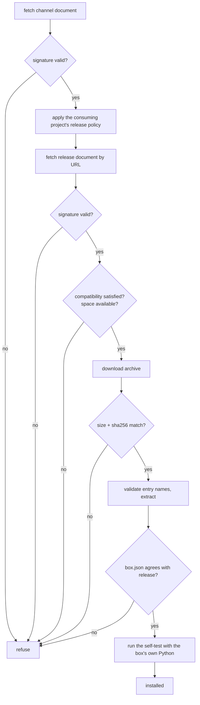

# Distributing Boxes

Scrollcase stops at a signed, verified box on disk. Uploading it, serving a registry, promoting a
channel, revoking a release — all of that belongs to whoever consumes Scrollcase. This page
explains what the build hands you, why it is shaped that way, and how to build distribution on
top of it without fighting the format.

::: info Why the boundary
A packaging tool that also serves a registry has to keep proving both sets of guarantees; one
that stops at a file on disk composes with any distribution mechanism you already have. Every one
of these features was left out deliberately, not overlooked. The reasoning is recorded in [Design Decisions](/concepts/design-decisions).
:::

## What a build produces

```text
.scrollcase/dist/
├── my-model-1.0.0-macos-aarch64-metal.zip
├── my-model-1.0.0-macos-aarch64-metal.release.json
├── my-model-beta-macos-aarch64-metal.channel.json
└── objects/
    └── boxes/my-model/1.0.0/macos-aarch64-metal/
        ├── 7d2c9a41e8b350f6c174a9de20358bf41c6e97d05a8b3f2619e4c7081da5b3f2.zip
        └── 4e81f0c93ab27d5e6081cf24b9a7d3e05f18c6b24a90d7e3518fc0a29b46d7e1.release.json
```

The top three are the human-facing artefacts, named by identity. The `objects/` tree is the
interesting one: **a staging tree laid out exactly as a bucket would be**, so whatever publishes
it uses the same keys the signed manifests already point to.

## Content addressing

Names derive from identity alone, so the archive, its release document and the staged objects
agree without any of them recording the others' paths:

| Thing | Name |
| --- | --- |
| Stem | `<boxId>-<version>-<targetId>` |
| Object prefix | `boxes/<boxId>/<version>/<targetId>` |
| Archive object | `<prefix>/<archive sha256>.zip` |
| Release object | `<prefix>/<release document sha256>.release.json` |

The chain is content-addressed end to end: **channel → release document (by its hash) → archive
(by its hash)**. Two consequences worth designing around:

- **Publishing is idempotent.** Re-uploading the same build writes the same keys with the same
  bytes. Combined with deterministic archives, a rebuild of the same commit is a no-op.
- **An object can never be replaced with different bytes under the same URL.** New bytes means a
  new hash means a new key. Serve `objects/` as immutable and cache it aggressively.

The URLs inside the signed documents are `<assetBaseUrl>/<object key>`, so pointing
`assetBaseUrl` at wherever you serve `objects/` from is all the coordination needed.

## Publishing

Any object store or static host will do. The shape of the operation is:

```sh
# Immutable objects — safe to cache forever.
aws s3 sync .scrollcase/dist/objects/ s3://my-bucket/ \
  --cache-control "public, max-age=31536000, immutable"

# The mutable pointer — short cache, uploaded last.
aws s3 cp .scrollcase/dist/my-model-beta-macos-aarch64-metal.channel.json \
  s3://my-bucket/channels/my-model/beta/macos-aarch64-metal.json \
  --cache-control "public, max-age=60"
```

Two rules:

1. **Objects first, pointer last.** The channel names a release document by hash; publishing the
   pointer before the object it names gives clients a dangling reference.
2. **The channel key is yours to choose.** The build does not dictate where the channel document
   lives — only the release document's URL, which it embeds. Pick a stable route your clients
   already know how to reach.

## Channels and rollout

The channel document is a small mutable pointer, signed independently from the release. That
separation is the point: **promoting a build never requires re-signing it**.

```jsonc
{
  "schemaVersion": 1,
  "kind": "scrollcase.box.channel",
  "channel": "beta",
  "boxId": "my-model",
  "target": { "platform": "macos", "arch": "aarch64", "accelerator": "metal" },
  "updatedAt": "2026-07-25T10:14:03+02:00",
  "cohortSalt": "9f2b7c1e04a83d5641b0e7c28a3d95f7",
  "releases": [
    { "version": "1.0.0", "releaseManifestUrl": "https://…/4e81….release.json", "rolloutPercentage": 100 }
  ]
}
```

A freshly built channel goes out at 100%. The schema can represent multiple release percentages,
but schema version 1 does **not** specify an interoperable cohort algorithm: it defines no identity
normalisation, byte framing, hash algorithm, integer extraction, percentage mapping, ordering, or
boundary fixtures. A consuming project may define and test those rules for its own clients, but
must not claim that unrelated implementations derive the same cohort from this format alone.

`cohortSalt` is deterministic builder output derived from `boxId` and `version`; the format does
not define how a client combines it with an identity. Until a future version supplies normative
fixtures, the only cross-client behavior documented here is a 100% release.

Promotion between channels (`development` → `beta` → `stable`) is publishing a channel document
naming the release you already built. Build once per channel name with `--channel`, or write the
promoted document yourself and sign it with the same key.

## Revocation

A published release is immutable, so withdrawing one is an explicit statement rather than a
deletion: clients keep honouring a revocations list even when the archive is still reachable.

The format defines the [revocations manifest](/reference/box-format#revocations-manifest) and the
`<namespace>.revocations` kind; Scrollcase does not emit it. Publish and sign it yourself, with
the same envelope and the same key, and have clients fetch it before installing or activating.

An empty `revocations` array is meaningful — it is a positive, signed statement that nothing is
revoked, which a client can distinguish from a missing or withheld document.

## The client's side



Whatever installs your boxes should do exactly what `scrollcase verify` does, in the same order:

1. Fetch the channel document, verify its signature, and apply the consuming project's release
   policy. Schema version 1 guarantees interoperability only for the 100% case.
2. Fetch the release document by the URL the channel names; verify its signature.
3. Check `compatibility` against the host — and **refuse a constraint it cannot evaluate** rather
   than assuming it passes.
4. Treat `installedSizeBytes` as a logical extracted-size lower bound. Require headroom for the
   archive, extracted files, temporary copies, and filesystem overhead.
5. Download the archive; check size and SHA-256 against the release.
6. Validate every entry name before final extraction.
7. Compare all shared `box.json` fields recursively against the release.
8. Run the self-test: `selfTest.pythonImports` with `pythonEntryPoint`, bounded by
   `selfTest.timeoutSeconds`.
9. With on-demand weights, fetch each asset and check its size and SHA-256 before first use.

Running `scrollcase verify --self-test` on the build machine covers the archive and temporary
extraction checks, not final installation, compatibility policy, rollout, or activation.

## Namespaces for existing publishers

If you already have boxes installed in the field under your own document kinds, keep emitting
them:

```sh
scrollcase build my-model --namespace acme.model-pack
# → kinds: acme.model-pack.release, acme.model-pack.channel, acme.model-pack.revocations
```

The namespace belongs to the publishing project precisely so that adopting Scrollcase does not
rename documents underneath clients that already recognise them. New projects can leave the
default, `scrollcase.box`.
